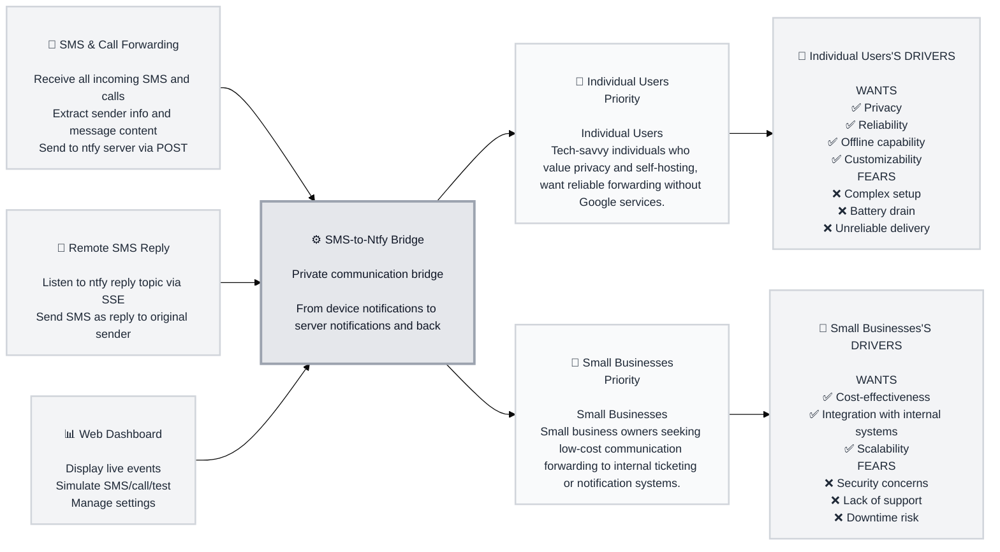

# Trigger Map Poster: sms-ntfy-android-app

> Visual overview connecting business goals to user psychology

**Created:** 2026-08-28
**Author:** Saeb
**Methodology:** Based on Effect Mapping (Balic & Domingues), adapted for WDS framework

---

## Strategic Documents

This is the visual overview. For detailed documentation, see:

- **01-Business-Goals.md** - Full vision statements and SMART objectives
- **02-Target-Groups.md** - All personas with complete driving forces
- **03-Feature-Impact-Analysis.md** - Prioritized features with impact scores
- **04-08-\*.md** - Individual persona detail files

---

## Vision

Create a fully functional native Kotlin Android application that forwards incoming SMS and calls to a self-hosted ntfy server, enables remote SMS replies via SSE, and includes a professional web dashboard. KMP remains an experimental scaffold without production feature parity.

---

## Business Objectives

### Objective 1: Deliver Android app that forwards SMS and calls to ntfy server with remote reply capability

- **Metric:** Percentage of SMS/calls successfully forwarded and replied
- **Target:** 99.9%
- **Timeline:** 3 months

### Objective 2: Provide professional web dashboard with live simulator and logs

- **Metric:** User satisfaction score
- **Target:** 4.5/5
- **Timeline:** 4 months

### Objective 3: Ensure zero Google Play Services dependency and LAN-only operation

- **Metric:** Number of Google dependencies
- **Target:** 0
- **Timeline:** 3 months

---

## Target Groups (Prioritized)

### 1. Individual Users

**Priority Reasoning:** Primary users needing personal SMS/call forwarding to self-hosted server

> Tech-savvy individuals who value privacy and self-hosting, want reliable forwarding without Google services.

**Key Positive Drivers:**
- Privacy
- Reliability
- Offline capability
- Customizability

**Key Negative Drivers:**
- Complex setup
- Battery drain
- Unreliable delivery

### 2. Small Businesses

**Priority Reasoning:** Need to forward business communications to internal systems

> Small business owners seeking low-cost communication forwarding to internal ticketing or notification systems.

**Key Positive Drivers:**
- Cost-effectiveness
- Integration with internal systems
- Scalability

**Key Negative Drivers:**
- Security concerns
- Lack of support
- Downtime risk

---

## Trigger Map Visualization

---

## Design Focus Statement
Ensure the system addresses core drivers of privacy, reliability, and offline capability while minimizing complexity and battery impact.

**Primary Design Target:** Individual Users

**Must Address:**
- Privacy
- Reliability
- Offline capability

**Should Address:**
- Customizability
- Integration with internal systems

---

## Cross-Group Patterns

### Shared Drivers
Privacy, Reliability, Offline capability

### Unique Drivers
Individual Users: Customizability
Small Businesses: Integration with internal systems, Cost-effectiveness

---

## Next Steps
- [ ] **Review detailed docs** - See 01-Business-Goals.md, 02-Target-Groups.md, 03-Feature-Impact-Analysis.md
- [ ] **Use for Feature Prioritization** - Reference feature impact scores
- [ ] **Guide UX Design** - Ensure designs address priority drivers
- [ ] **Validate with Users** - Test assumptions with real target group members
- [ ] **Update as Learnings Emerge** - This is a living document

---

_Generated with Whiteport Design Studio framework_
_Trigger Mapping methodology credits: Effect Mapping by Mijo Balic & Ingrid Domingues (inUse), adapted with negative driving forces_
